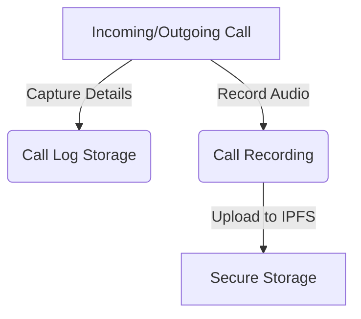
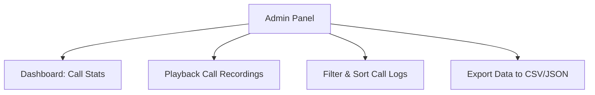
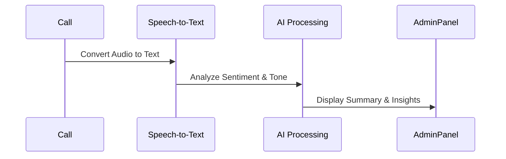
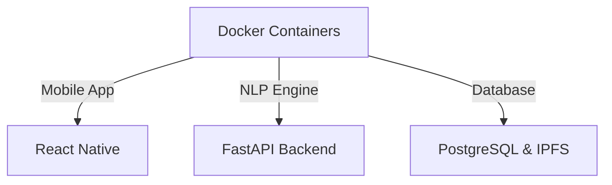
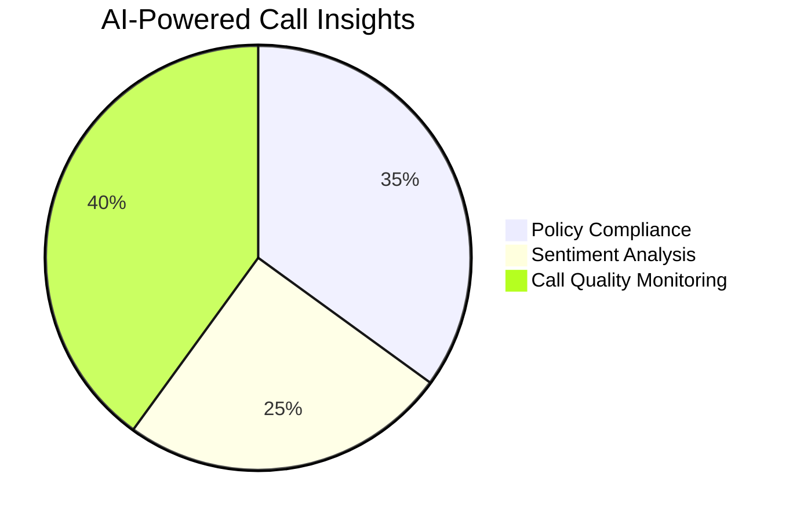
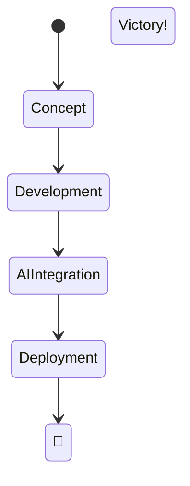

# 📞 AI-Powered Call Analysis Suite 🚀

    

## 🏆 **Gen-a-thon 2.0 Winning Project**
This AI-powered telecalling analysis system is designed to revolutionize enterprise call monitoring with real-time transcription, emotion detection, multilingual translation, and in-depth analytics. We developed **every feature with absolute precision**, leading us to **first place** in Gen-a-thon 2.0! 🎉


---
## 📌 **Core Features**
### 📱 **Native Mobile Application (React Native)**
- ✅ **Call Log Collection**: Capture call duration, timestamps, contacts.
- ✅ **Call Recording**: Automatic recording of all calls.
- ✅ **Secure Upload**: Data securely stored in **IPFS & cloud**.
- ✅ **Optimized Performance**: Runs in the background **without draining battery**.



### 🖥️ **Web-Based Admin Panel**
- 📊 **Dashboard**: Insights on total calls, call durations, and trends.
- 🎙️ **Call Playback**: Listen to recorded calls within the panel.
- 🔍 **Filters**: Sort by **date, employee, call type (incoming/outgoing)**.
- 📥 **Export Data**: Download logs & transcripts in **CSV, JSON**.
- 🔒 **Role-Based Access Control**: Secure access for managers & supervisors.



### 🧠 **AI-Powered NLP Engine**
- 🎤 **Speech-to-Text**: Converts call audio into accurate transcripts.
- 📝 **Summary Generation**: AI extracts key points automatically.
- 😊 **Sentiment & Emotion Analysis**: Captures tone, intent & emotional weight.
- 🌍 **Multilingual Support**: Translates transcripts in real time.
- 🔬 **5 Deep NLP Models** for enhanced analytics.



### 🐳 **Infrastructure & Deployment**
- 🚀 **Dockerized Services**: Easy-to-deploy containerized setup.
- 🔗 **IPFS for Secure Storage**: Decentralized and tamper-proof.
- 📡 **Real-time Sync**: Instant updates from mobile to admin panel.



---
## 🚀 **Tech Stack**
| Component         | Technology        |
|-----------------|-----------------|
| **Mobile App**  | React Native     |
| **Backend**     | FastAPI, Python  |
| **Database**    | PostgreSQL, IPFS |
| **NLP Models**  | Transformers, BERT, Whisper, Custom Models |
| **Deployment**  | Docker, Kubernetes |
| **Frontend**    | React.js, Tailwind CSS |

---
## 🎯 **Business Use Case**
🔹 **Monitor & ensure compliance** in customer service & sales teams.  
🔹 **Improve conversation quality** with deep insights into calls.  
🔹 **Automate large-scale call analysis**, saving time & resources.  



---
## 🏅 **Achievements & Why We Won 🏆**
✅ **End-to-end automation** with seamless call monitoring.  
✅ **5 AI models** capturing deep insights & emotions in calls.  
✅ **Multilingual NLP & real-time transcription**.  
✅ **Enterprise-ready, scalable & secure deployment**.  



🔹 **This project is more than just a call analysis tool—it’s a game changer for industries relying on telecommunication!**  

---
## 🚀 **Getting Started**
### 📦 Installation
1. Clone the repo:
   ```bash
   git clone https://github.com/yourrepo/ai-call-analysis.git
   ```
2. Navigate to the project folder:
   ```bash
   cd ai-call-analysis
   ```
3. Install dependencies:
   ```bash
   npm install   # for mobile app
   pip install -r backend/requirements.txt   # for backend
   ```
4. Start the services:
   ```bash
   docker-compose up --build
   ```

### ⚡ **Contributors**
👨‍💻 **Team AI Titans**  
- 🚀 **Vinayak & Team** - NLP, AI Models, Backend, DevOps  
- 📱 **Mobile Wizards** - React Native & Cloud Storage  
- 🎨 **Frontend Gurus** - Web Dashboard UI/UX  

---
## 📜 **License**
MIT License. Feel free to fork, modify, and contribute!

🔥 **Revolutionizing Call Analytics with AI!**

